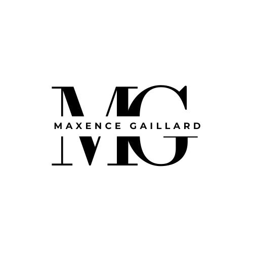

<div align="center">

# `MG.` — Portfolio

**Maxence Gaillard** — Développeur Web & Logiciel

[](https://maxs-gld.github.io/Portfolio/)
[](https://developer.mozilla.org/fr/docs/Web/HTML)
[](https://developer.mozilla.org/fr/docs/Web/CSS)
[](https://developer.mozilla.org/fr/docs/Web/JavaScript)

<br>



<br>

*Portfolio personnel conçu from scratch — sans framework, sans dépendance, 100% vanilla.*

### [`maxs-gld.github.io/Portfolio`](https://maxs-gld.github.io/Portfolio/)

[**Voir le site en ligne**](https://maxs-gld.github.io/Portfolio/) · [**Signaler un bug**](https://github.com/maxs-gld/Portfolio/issues)

---

</div>

<br>

## Aperçu

Portfolio interactif immersif mettant en avant mes compétences, projets et parcours en tant que développeur web & logiciel. Le site mise sur des animations fluides, un design sombre premium et une expérience utilisateur travaillée jusque dans les moindres détails.

> **Zero framework. Zero library JS. Pure HTML, CSS & JavaScript.**

<br>

## Features

### Animations & Interactions

| Feature | Description |
|---|---|
| **Preloader cinématique** | Animation de chargement avec compteur, reveal des initiales et barre de progression |
| **Curseur custom** | Curseur personnalisé avec effet de suivi fluide, hover magnétique et mix-blend-mode |
| **Warp Navigation** | Transition de navigation "warp speed" — flash, speed lines, particle burst, glitch bars, vignette |
| **Scroll Reveal** | Animations d'apparition au scroll via Intersection Observer |
| **Magnetic Elements** | Éléments interactifs qui suivent le curseur avec un effet magnétique |
| **Text Scramble** | Effet de brouillage de texte au hover sur les titres de projets |
| **3D Tilt** | Inclinaison 3D perspective sur les cartes de projets au mousemove |
| **Parallax Orbs** | Orbes de couleur en arrière-plan avec parallax au scroll |
| **Card Glow** | Effet de lueur radiale qui suit le curseur sur les cartes |
| **Particle System** | Canvas de particules interactif avec connexions dynamiques et répulsion au curseur |

### Design System

| Feature | Description |
|---|---|
| **Dark / Light Theme** | Changement de thème avec animation circulaire expansive + rayons lumineux |
| **Glass Morphism** | Cartes et composants avec effet verre dépoli |
| **Noise + Grid Overlay** | Textures de bruit SVG et grille subtile en overlay |
| **Gradient Typography** | Texte en dégradé multi-couleurs via background-clip |
| **CSS Custom Properties** | Système de design tokens complet via variables CSS |
| **Responsive Design** | Adaptatif mobile-first avec breakpoints à 960px et 600px |

### Fonctionnalités

| Feature | Description |
|---|---|
| **Bilingue FR / EN** | Toggle de langue complet via data-attributes, sans rechargement |
| **Marquee infini** | Bandeau défilant continu des technologies maîtrisées |
| **Timeline interactive** | Parcours chronologique avec points animés et tags |
| **Certifications** | Grille de certifications avec liens directs et statuts |
| **Section Veille Tech** | Veille technologique structurée avec problématique, analyse et sources |
| **CV téléchargeable** | Téléchargement direct du CV en PDF |

<br>

## Architecture

```
Portfolio/
├── index.html          # Structure HTML sémantique (665 lignes)
├── style.css           # Styles, animations, thèmes, responsive (1700+ lignes)
├── script.js           # Interactions, particules, transitions (430+ lignes)
├── images/
│   ├── logo_portfolio.png
│   ├── image_code.jpg
│   └── image_clavier_code.jpg
└── README.md
```

**Aucune dépendance JS.** Seules ressources externes :
- [Google Fonts](https://fonts.google.com/) — Syne, JetBrains Mono, Instrument Sans
- [Font Awesome 6](https://fontawesome.com/) — Icônes

<br>

## Stack technique détaillée

```
HTML5          → Sémantique, data-attributes pour i18n, structure accessible
CSS3           → Custom Properties, Grid, Flexbox, @keyframes, clip-path,
                 backdrop-filter, mix-blend-mode, clamp(), media queries
JavaScript ES6 → Canvas API, Intersection Observer, requestAnimationFrame,
                 Event delegation, DOM manipulation, Class syntax
```

<br>

## Performances

- **0 dépendance** npm / node_modules
- **0 build step** — ouvrir `index.html` et c'est parti
- **Animations GPU-accelerated** via `transform` et `opacity`
- **Intersection Observer** pour le lazy reveal (pas de scroll event spam)
- **requestAnimationFrame** pour les animations canvas fluides à 60fps

<br>

## Lancer le projet

```bash
# Cloner le repo
git clone https://github.com/maxs-gld/Portfolio.git

# Ouvrir dans le navigateur
cd Portfolio
open index.html
# ou utiliser Live Server dans VS Code
```

Pas de `npm install`. Pas de `npm run build`. Pas de config. **Just open it.**

<br>

## Palette de couleurs

| Thème | Variable | Couleur | Hex |
|---|---|---|---|
| Dark | `--accent` | Vert néon | `#c8ff00` |
| Dark | `--accent2` | Cyan | `#00f0ff` |
| Dark | `--accent3` | Rose | `#ff3366` |
| Dark | `--bg` | Noir profond | `#060608` |
| Light | `--accent` | Violet | `#5d00e6` |
| Light | `--accent2` | Bleu | `#0075ff` |
| Light | `--accent3` | Rouge | `#e6003a` |
| Light | `--bg` | Beige clair | `#f5f3ee` |

<br>

## Polices

| Police | Usage |
|---|---|
| **Syne** (800) | Titres, noms, éléments d'impact |
| **JetBrains Mono** (400/500/700) | Labels, tags, éléments techniques, code |
| **Instrument Sans** (400-700) | Corps de texte, descriptions |

<br>

## Auteur

<div align="center">

**Maxence Gaillard** — Étudiant BTS SIO SLAM

[](https://www.linkedin.com/in/maxence-gaillard-182161328)
[](https://github.com/maxs-gld)
[](mailto:maxence.gaillard.49@gmail.com)

</div>

<br>

---

<div align="center">

<sub>Conçu avec passion et beaucoup de `requestAnimationFrame` — © 2026 Maxence Gaillard</sub>

</div>